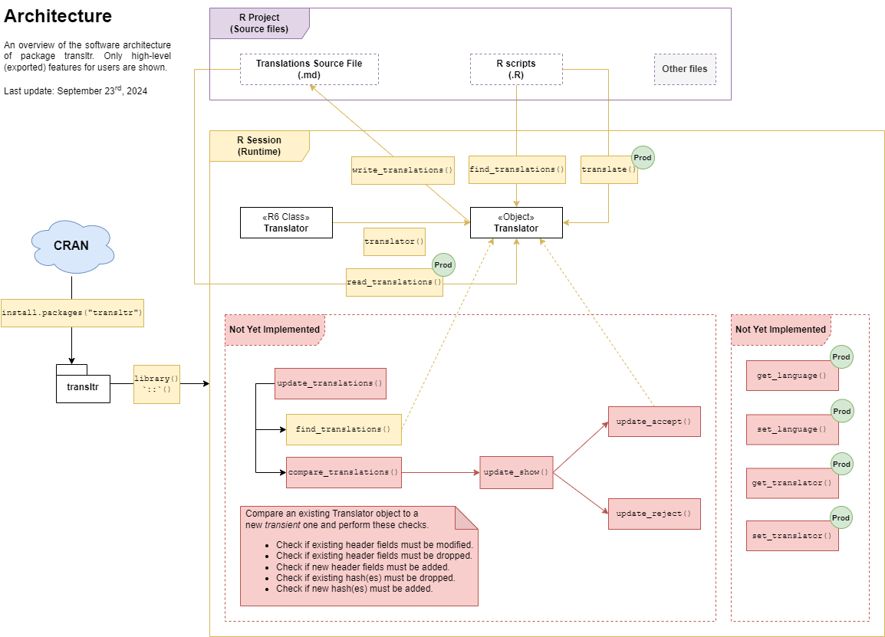

# `transltr`

<!-- badges: start -->

<!-- badges: end -->

An internationalization framework that enables full support of many languages
in any R application. Detect text to translate within a project. Import and
manage translations with a user-friendly interface. Easily export source text
that requires translation to a plain text format that fosters collaboration
with other non-technical and external collaborators.

## Why `transltr`?

Trying to extend `base::gettext()` to functions other than `stop()`,
`warning()`, and `message()` usually leads to fragile and incomplete ad-hoc
implementations.

* Uses Markdown files instead of PO (Portable Object) files for translations.

* Markdown files are easily sharable, maintainable, and modifiable, even by
non-technical collaborators such as professional translators.

* Easier API compared to `base::gettext()`.

* Can be used within any context and functions (unlike `base::gettext()`).

* Uses carefully chosen dependencies: `digest`, `R6`, and `yaml`.

* Fast speed.

## Installation

The plan is to submit `transltr` to CRAN before December 2024 once it
reaches a more mature stage. Until further notice, please do not attempt to
use it. It should be considered as being in a pre-alpha stage until further
notice.

## Usage

Write your application as you normally would. Whenever you require a piece
of text to be translated at runtime, wrap it with `transltr::translate()`.

More to come later. See the proposed architecture below. You may also read
`Rd` files in `man/`.

## Proposed internal architecture

This diagram gives an overview of how the package will work once completed.

## Bugs and feedback

Submit them [here](https://github.com/jeanmathieupotvin/transltr/issues/new).
Thank you for your collaboration.
